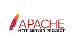
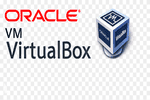

# Deliverable 1 Submission

## Basic Terminology

### What is a web server?
A web server is a combination of hardware and software that delivers web content to users over the Internet or an intranet.

The hardware is a computer that stores web server software and can connect to the Internet.
The software is a program that controls how users access hosted files. The most basic server is an HTTP one, that understands URLs(addresses) and HTTP(protocol) 

### What are some example web server applications?

Here's a table with examples of web server applications:

| **Name**           | **License**              | **Project Website**                                            |
| ------------------ | ------------------------ | -------------------------------------------------------------- |
| Apache HTTP Server | Open Source (Apache 2.0) | [https://httpd.apache.org](https://httpd.apache.org)           |
| Nginx              | Open Source (BSD-like)   | [https://nginx.org](https://nginx.org)                         |
| Microsoft IIS      | Proprietary              | [https://www.iis.net](https://www.iis.net)                     |
| LiteSpeed          | Free & Commercial        | [https://www.litespeedtech.com](https://www.litespeedtech.com) |
| Tomcat             | Open Source (Apache 2.0) | [https://tomcat.apache.org](https://tomcat.apache.org)         |

### Web Server Applications:

1. **Apache HTTP Server**    
    
   Apache HTTP Server is an open-source, highly configurable, and cross-platform web server widely used for hosting websites and applications. It supports extensive customization through modules. 

2. **Nginx**  
     
   Nginx is known for its exceptional performance and ability to handle large numbers of simultaneous connections, making it ideal for high-traffic websites. It can also function as a reverse proxy and load balancer.  

3. **Microsoft IIS**   
    
   Microsoft IIS is a proprietary web server integrated with Windows and designed for enterprise-grade hosting solutions, supporting ASP.NET and other Microsoft technologies. It is widely used in corporate environments.  

4. **LiteSpeed**   
    
   LiteSpeed is a high-performance alternative to Apache, offering both free and commercial tiers, and is popular for its speed and efficiency in managing web server traffic. It also supports Apache's .htaccess configuration.  

5. **Tomcat**   
    
   Tomcat is an open-source web server and servlet container specifically designed for Java-based web applications. It is a project under the Apache Software Foundation.  

### What is virtualization?
Virtualization is the process of creating a virtual version of resources such as servers, storage devices, or operating systems. It enables multiple virtual machines to run on a single physical host, optimizing hardware utilization and flexibility.

### What is virtualbox? 
 
Oracle VirtualBox is a free and open-source virtualization application that allows users to create and manage virtual machines on their personal computers. It supports multiple host operating systems (Windows, macOS, Linux) and can run various guest OSes.

### What is a virtual machine?
A virtual machine is a software-based emulation of a physical computer. It includes a virtualized CPU, memory, storage, and network interface, allowing it to run an operating system and applications just like a physical computer.

### What is Ubuntu Server? 
 
Ubuntu Server is a Linux distribution specifically designed for server environments. It provides a lightweight and secure platform for hosting web servers, databases, file storage, and other server-based applications. Unlike the desktop version, Ubuntu Server typically lacks a graphical user interface (GUI).

### What is a firewall?
A firewall is a network security system that monitors and controls incoming and outgoing network traffic based on predefined rules.

Hardware Firewall: Dedicated devices positioned between a network and external connections.
Software Firewall: Applications installed on operating systems (e.g., Windows Defender Firewall).

### What is SSH?
Secure SHell is a protocol for securely accessing and managing a remote computer over an encrypted connection. It is widely used for:

* Remote server administration.
* Secure file transfer (via SCP or SFTP).
* Secure tunneling.
* SSH typically uses port 22 and requires authentication (password or key-based).
  

## Other Relevant Concepts

### **HTTP/HTTPS**
HTTP (Hypertext Transfer Protocol) is the standard protocol for transferring data on the web, and HTTPS is the secure version of HTTP that encrypts data using SSL/TLS to prevent unauthorized access and ensure privacy.  
*Example:* A URL starting with `http://` is non-secure, whereas `https://` indicates a secure connection.

### **Proxy**
A **proxy** is an intermediary server that sits between a client and a destination server, forwarding requests and responses. It is often used for security, anonymity, caching, or load balancing.  
*Example:* A proxy can be used to mask the client's IP address or filter web traffic.

### **Servlet**
A **Servlet** is a Java-based server-side program that extends the capabilities of a web server. It handles client requests, processes them, and returns a response, often in the form of dynamic content.  
*Example:* Java Servlets are commonly used to create web applications by generating dynamic HTML or interacting with databases.

### **Systemd**
**Systemd** is an init system and service manager for Linux operating systems, responsible for bootstrapping the user space and managing services and system resources.  
*Example:* Systemd is used to start, stop, and monitor processes, such as running web servers or databases, on a Linux server.

### **Systemctl**
**Systemctl** is a command-line tool used to control and manage systemd services in Linux. It allows users to start, stop, restart, and query the status of services.  
*Example:* `systemctl start nginx` would start the Nginx web server on a system that uses systemd.

### **Virtual Hosts**
**Virtual Hosts** are a method of hosting multiple domain names on a single server, allowing for different websites to run on the same physical or virtual machine. This is commonly configured in web servers like Apache and Nginx.  
*Example:* Apache can serve multiple websites by configuring different domain names in the virtual hosts settings.

### **Log File**
A **log file** is a record of events, processes, or transactions that occur within a system or application. It helps with debugging, monitoring, and auditing.  
*Example:* A web server's log file might record information about client requests, errors, and response times.
