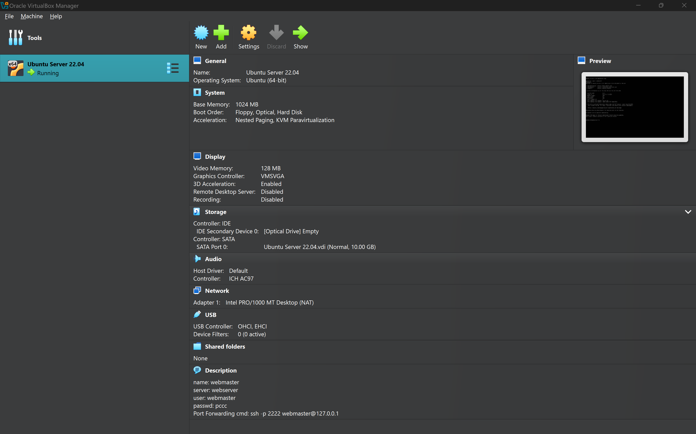
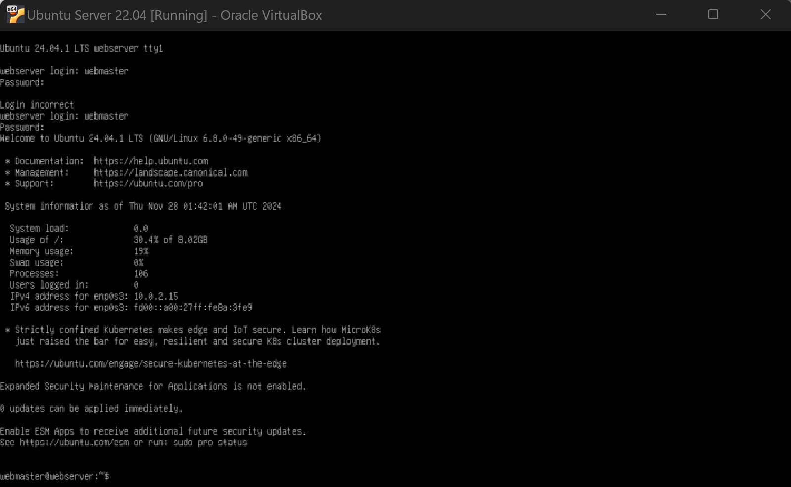
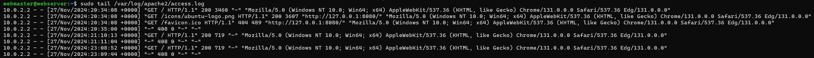
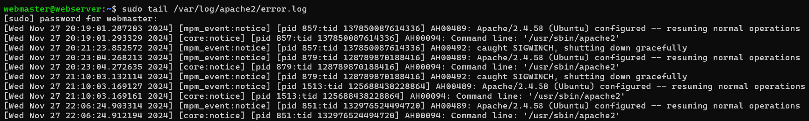

# Deliverable 2 Submission
## Server Specifications

## Ubuntu Login Screen

## Questions
3. **What is the IP address of your Ubuntu Server Virtual Machine?**
   
   ```ip address```
   \> 127.0.0.1

4. **How do you enable the Ubuntu Firewall?**

   ```sudo ufw enable```

5. **How do you check if the Ubuntu Firewall is running?**
   
   ```sudo ufw status```

6. **How do you disable the Ubuntu Firewall?**
   
   ```sudo ufw disable```

7. **How do you add Apache to the Firewall?** 
   
   ```sudo ufw allow 'Apache'```

8. **What is the command you used to install Apache?**
   
   ```sudo apt install apache2 -y```

9. **What is the command you use to check if Apache is running?**
    
    ```sudo systemctl status apache2```

10. **What is the command you use to stop Apache?**
    
    ```sudo systemctl stop apache2```

11. **What is the command you use to restart Apache?**
    
    ```sudo systemctl restart apache2```

12. **What is the command used to test Apache configuration?**
    
    ```sudo apache2ctl configtest```

13. **What is the command used to check the installed version of Apache?**
    
    ```apache2 -v```

14. **What are the most common commands to troubleshoot Apache errors? Provide a brief description of each command.**    
    
    - **Check Apache status**:
  
      ```sudo systemctl status apache2```

      Provides details on whether Apache is running and highlights errors.

    - **Check configuration for syntax errors**:
  
      ```sudo apache2ctl configtest```

      Validates the Apache configuration for errors.

    - **Restart Apache**:
     
      ```sudo systemctl restart apache2```
      
      Reloads Apache after making changes.

15. **Which are Apache Log Files, and what are they used for? Provide examples and screenshots.**
   
    Apache log files are located in `/var/log/apache2/`. The most common log files are:
    
    - **Access Log (`access.log`)**: Logs all requests made to the server. Useful for tracking visitors.
        
        ```sudo tail /var/log/apache2/access.log```      
        
    
    - **Error Log (`error.log`)**: Logs error messages, useful for troubleshooting.   
        
        ```sudo tail /var/log/apache2/error.log```
        