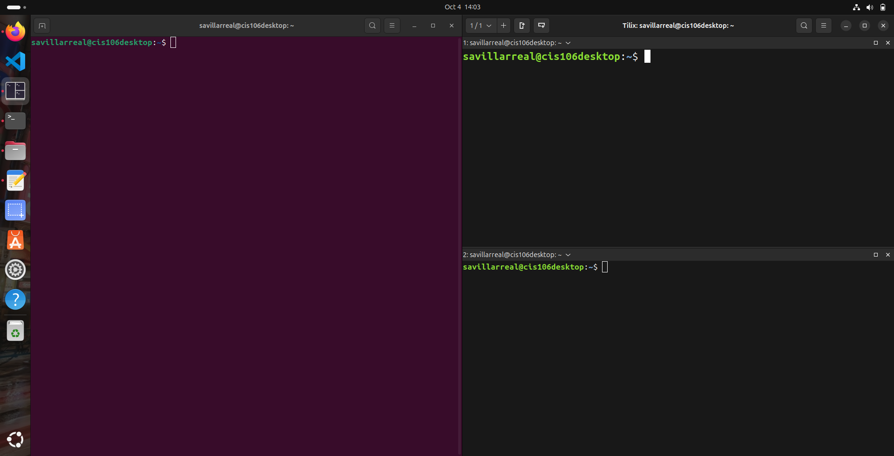
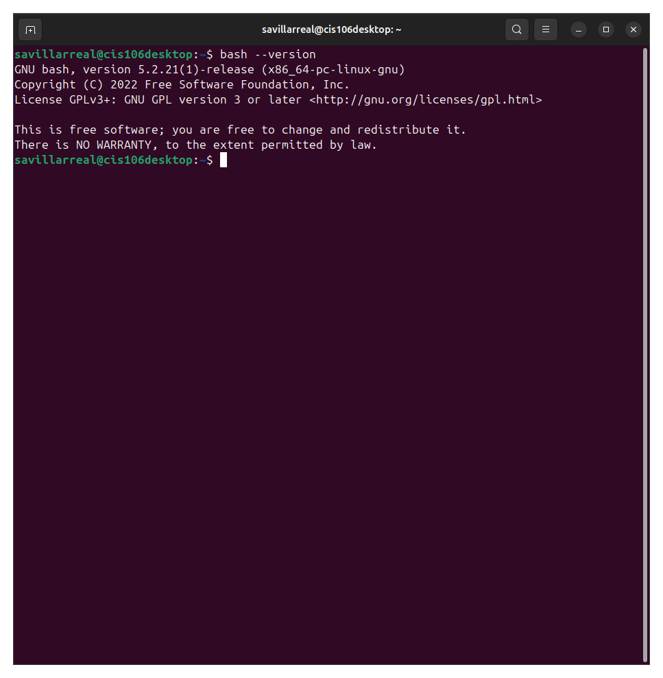
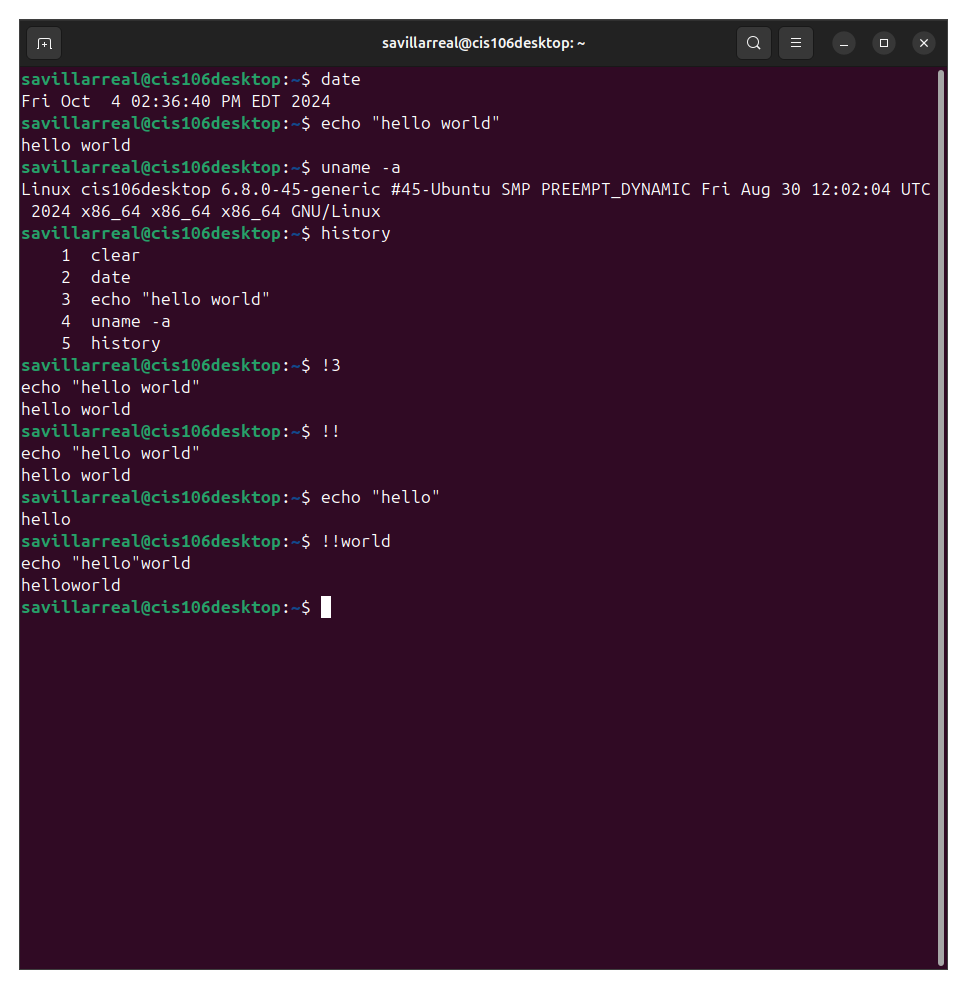
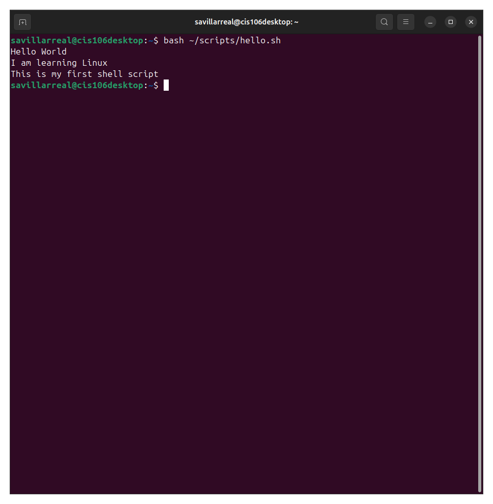
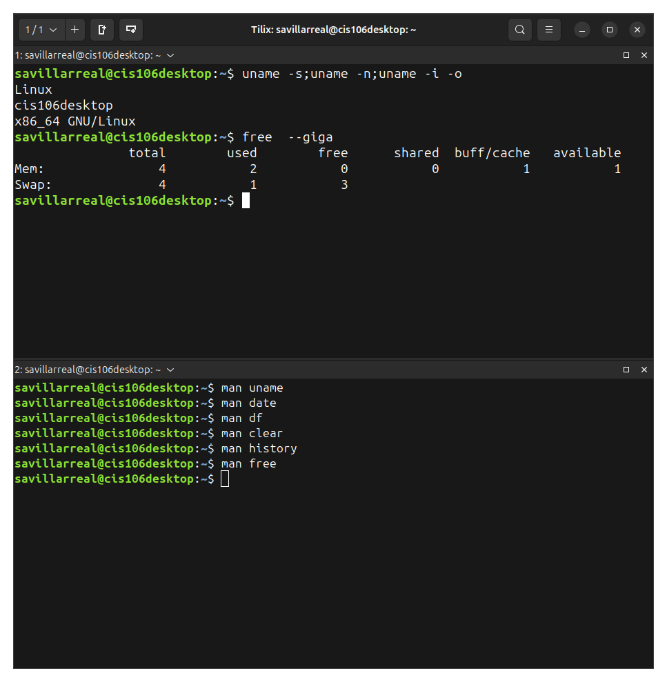
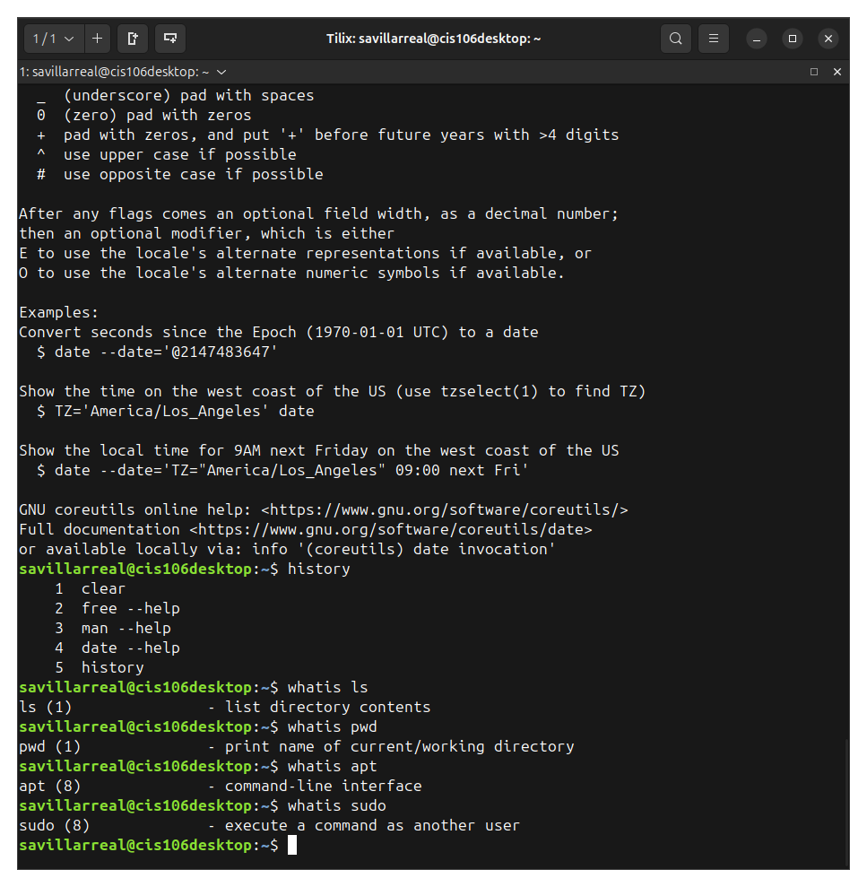
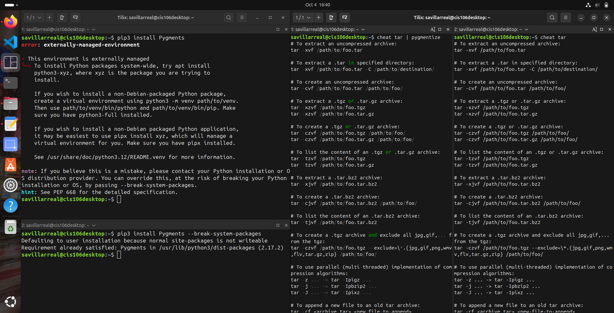

# Week Report 3

## Completed work for week 3

* [Lab3]()

* [Notes3]()

## Practice

### Practice 1

* 

### Practice 2

* 

### Practice 3

* 

### Practice 4

* 

### Practice 5

* 

### Practice 6

* 

### Practice 7

* 

### Practice 1 - Managing Software

* 

### Practice 3 - Managing Software

* 