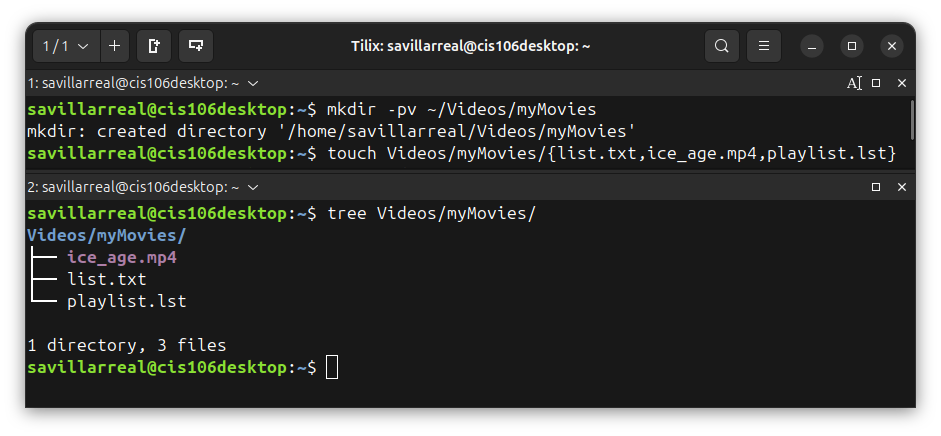

# Week Report 6

## Completed work for week 6

* [Lab6](https://github.com/savillanux23/cis106/blob/main/labs/lab6/lab6.md)

* [Notes6](https://github.com/savillanux23/cis106/blob/main/notes/notes6/notes6.md)

## Practice Wildcards
### Practice 1

### Practice 2

### Practice 3

### Practice 4

### Practice 5

## Practice SHELL SCRIPTING

### Practice 6

### Practice 7

### Practice 8

